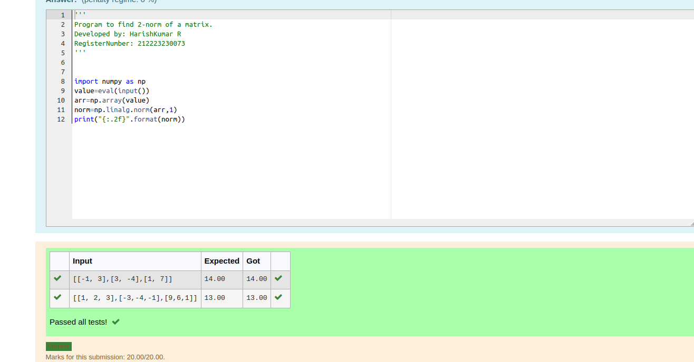
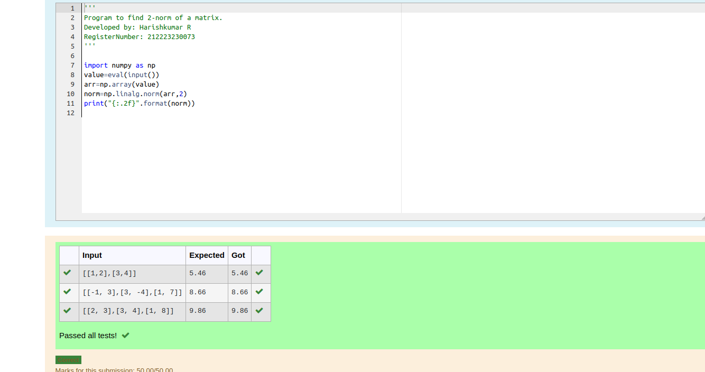
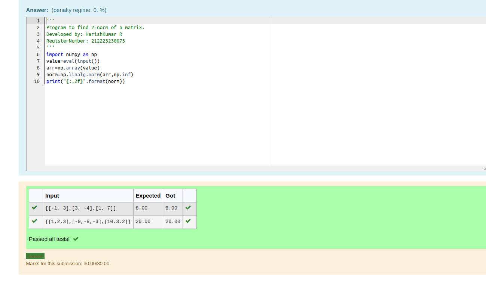

# Norm of a matrix
## Aim
To write a program to find the 1-norm, 2-norm and infinity norm of the matrix and display the result in two decimal places.
## Equipment’s required:
1.	Hardware – PCs
2.	Anaconda – Python 3.7 Installation / Moodle-Code Runner
## Algorithm:
	1. Get the input matrix using np.array()   
    2. Find the 2-norm of the matrix using np.linalg.norm()
	3. Print the norm of the matrix in two decimal places.
## Program:
### Program-1
```Py
'''
Program to find 2-norm of a matrix.
Developed by: HarishKumar R
RegisterNumber: 212223230073
'''


import numpy as np
value=eval(input())
arr=np.array(value)
norm=np.linalg.norm(arr,1)
print("{:.2f}".format(norm))
```
### Program-2
```py
import numpy as np
value=eval(input())
arr=np.array(value)
norm=np.linalg.norm(arr,2)
print("{:.2f}".format(norm))
```
### Program-3
```py

import numpy as np
value=eval(input())
arr=np.array(value)
norm=np.linalg.norm(arr,np.inf)
print("{:.2f}".format(norm))
```
## Output:
### 1-Output


### 2-Output

### 3-Output


## Result
Thus the program for 1-norm, 2-norm and Infinity norm of a matrix are written and verified.
